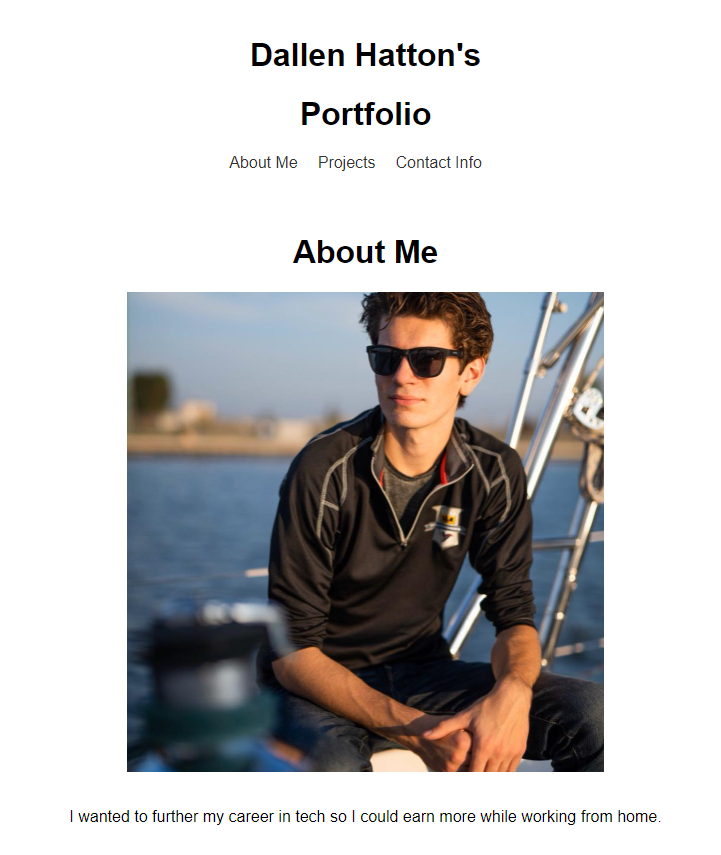
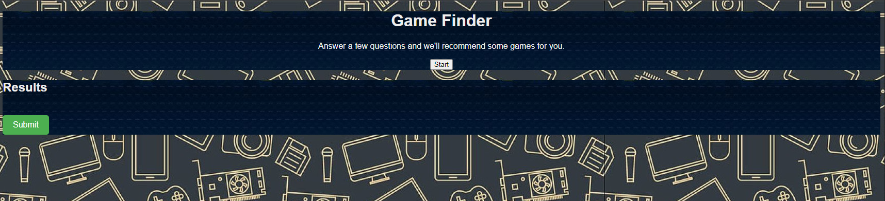

## React-Portfolio ##
Module 20 Challenge

## Description ##
My motivation to make this project was to show a potential employer my deployed React portfolio of work samples. I built this project so they can assess whether I'm a good candidate for an open position.

## Table of Contents ##

[Screenshots][screenshots]

[screenshots]: https://github.com/Dhatton01/React-Portfolio#screenshotsots

[Deployed Link][deployed link]

[deployed link]: https://dhatton01.github.io/React-Portfolio/

[Questions][questions]

[questions]: https://github.com/Dhatton01/React-Portfolio#questions

## Screenshots ##

## Deployed Link ##
https://dhatton01.github.io/React-Portfolio/

## Questions ##
If any users have any questions regarding this project, then my GitHub username is KyleKryst. A link to my GitHub is provided [here](https://github.com/Dhatton01). 